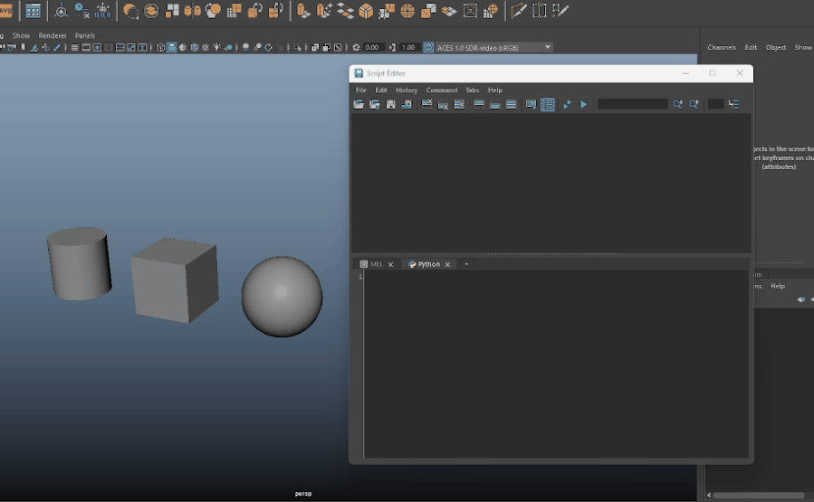
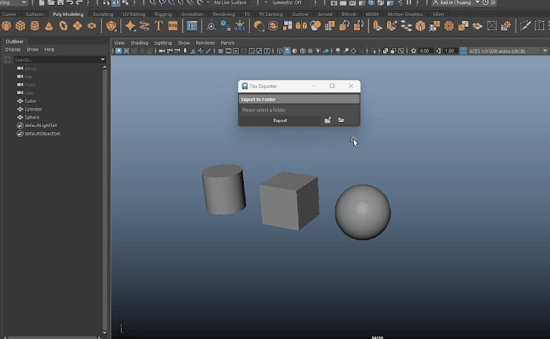

# 📦 Maya FBX Exporter
This is a Python script with a simple GUI interface that exports selected objects in Autodesk Maya to the `.fbx` format.
I created this tool to make exporting assets to FBX faster and more automated. It allows me to export 3D models with just a few clicks, instead of manually exporting each one individually.

---

## 📝 Features
- Exports selected mesh objects to FBX format
- Simple and user-friendly UI with folder selection for output path
- Auto-names exported files based on the object names in Maya
- Quick access to the export folder through the interface

---

## 📜 How to use:
1. Open the Script Editor in Maya (switch to the Python tab).
2. Drag and drop FbxExporter.py into the Script Editor.
3. Press Ctrl + A (Windows) or Cmd + A (Mac) to select the entire script.
4. Click the Execute button to run the script.

---

## 📤 Exporting Assets

1. Select the objects in your scene that you want to export.
2. Use the folder icon to choose the export directory.
3. Click the Export button.
4. Click the folder icon on the right to open the export folder.

## ✅ Conclusion
This tool was built to improve and simplify my 3D asset export workflow inside Maya. It helped me gain more experience with Python scripting for automation and UI creation using Maya’s built-in libraries.

